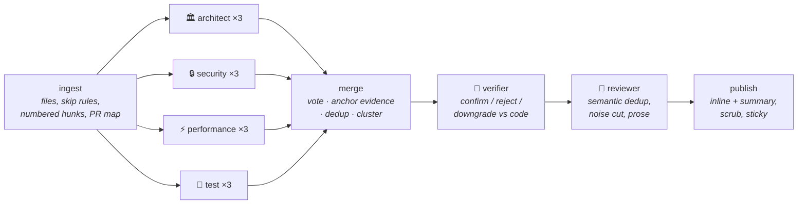

# 🛡️ PR Sentinel

**Multi-agent code review for your pull requests — runs in your CI, brings your own key, and shows you which agent found what.**

[](https://github.com/moazmo/pr-sentinel/actions/workflows/ci.yml)
[](LICENSE)
[](https://www.python.org/)
[](#accuracy-is-a-systems-problem-not-a-model-size-problem)
[](#what-it-costs)


Five specialized LLM agents — **Architect, Security, Performance, Test, and Reviewer** — each examine your PR diff from a different angle, then merge into **one prioritized, deduplicated comment**. No walls of noise, no black box: every finding is attributed to the agent that raised it, and every agent prompt is [readable in this repo](src/pr_sentinel/prompts/).

## The problem

Code review is the most expensive bottleneck in most teams. Senior engineers burn hours reviewing PRs; under-reviewed code ships bugs; and most AI tools help *write* code, not critically *review* it. The AI reviewers that do exist are usually noisy black boxes — and false positives are why people uninstall them.

## 30-second install

Add `.github/workflows/pr-sentinel.yml` to your repo:

```yaml
name: PR Sentinel
on:
  pull_request:
    types: [opened, synchronize, reopened]
permissions:
  contents: read
  pull-requests: write
jobs:
  review:
    runs-on: ubuntu-latest
    steps:
      - uses: moazmo/pr-sentinel@v2
        with:
          api_key: ${{ secrets.PR_SENTINEL_API_KEY }}
```

Then add one repository secret: **Settings → Secrets and variables → Actions → New repository secret**, name it `PR_SENTINEL_API_KEY`, paste your LLM provider key. Done — no checkout step, no other configuration required.

> This workflow is the hardened version on purpose: `pull_request` trigger (never `pull_request_target`) and minimal permissions. See [Security model](#security-model).

## What it costs

PR Sentinel speaks the **OpenAI-compatible protocol with a configurable `base_url`** — one integration reaches OpenAI, OpenRouter, Groq, DeepSeek, Mistral, and local Ollama. A typical PR (~3k diff tokens × 4 analysts + reviewer) costs:

| Route | Model | $/1M in / out | Typical PR |
|---|---|---|---|
| Zero-config default | OpenAI `gpt-5-mini` | $0.25 / $2.00 | **≈ $0.01** |
| Cheapest strong option | DeepSeek V4 Flash | $0.14 / $0.28 | **≈ $0.004** |
| Best cheap closed-model | Claude Haiku 4.5 (via OpenRouter) | $1.00 / $5.00 | ≈ $0.03 |
| Free | OpenRouter free models | $0 | $0 (rate-limited) |
| Fully private | Ollama on a self-hosted runner | $0 | $0 — code never leaves your infra |

To use the cheapest option, drop this in `.pr-sentinel.yml`:

```yaml
provider:
  base_url: https://api.deepseek.com/v1
  model: deepseek-v4-flash
```

Every review comment shows its own token count and estimated cost in the footer. There's also a `dry_run: true` mode that posts a cost estimate **without making any LLM calls** — try PR Sentinel before spending a cent.

## The agents

| Agent | Looks for |
|---|---|
| 🏛️ **Architect** | Separation-of-concerns violations, leaky abstractions, coupling, misleading naming |
| 🔒 **Security** | Injection (SQL/shell/XSS), exposed secrets, authz/authn gaps, unsafe deserialization |
| ⚡ **Performance** | O(n²) patterns, N+1 queries, blocking calls in async paths, unnecessary allocations |
| 🧪 **Test** | New behavior without tests, untested error paths, assertions removed, broad mocks |
| 🔎 **Verifier** | Adjudicates every surviving finding against the diff — confirm / reject / downgrade — before anything posts |
| 🧠 **Reviewer** | The aggregator: resolves semantic duplicates, cuts noise, writes the final review |

The Verifier + Reviewer are the difference between "multi-agent" and "a wall of noise": the Reviewer's prompt is explicitly biased — *when in doubt, drop the finding; three real issues beat thirty maybes* — and the Verifier fact-checks each finding against the code first. All prompts live in [`src/pr_sentinel/prompts/`](src/pr_sentinel/prompts/) — read them, tune them, PR them.

## Architecture



A fan-out/fan-in [LangGraph](https://github.com/langchain-ai/langgraph) graph, no loops. Each analyst runs **3 samples in parallel** and majority-votes (self-consistency); the merge pass anchors every finding's quoted evidence to a real diff line (dropping hallucinations) and deterministically clusters duplicates; the Verifier adjudicates; the Reviewer resolves semantic duplicates and writes prose. If an agent fails, the others still report — partial review beats no review. Findings anchored to an added line post as **inline review comments**; the rest stay in one sticky summary comment.

Large PRs: files are fetched via the paginated files API (the only endpoint that doesn't fall over past 3,000 lines), reviewed per-file within token budgets with a shared "PR map" for cross-file context (plus ±8 lines of head-ref context per hunk), and anything truncated or skipped is **disclosed in the comment**, never silently dropped. When the file cap bites, the highest-review-priority files (source over docs, by churn) are kept.

## Configuration

Optional `.pr-sentinel.yml` at the repo root — zero config works out of the box. All fields and their defaults:

```yaml
provider:
  base_url: https://api.openai.com/v1     # any OpenAI-compatible endpoint
  model: gpt-5-mini
  api_key_env: PR_SENTINEL_API_KEY        # name of the secret env var
  kind: openai-compat                     # or "anthropic" for the native Messages API
  analyst_model: ""                       # optional: cheaper model for the 4 analysts
  review_model: ""                        # optional: model for verifier + reviewer
agents:
  enabled: [architect, security, performance, test]   # reviewer always runs
accuracy:
  samples: 3                  # self-consistency samples per analyst (1 disables the ensemble)
  min_support: 2              # a finding must appear in this many samples to survive the vote
  verifier: true              # run the adjudication pass before the reviewer
min_severity: medium          # report at/above: critical|high|medium|low|nit
ignore:                       # appended to the built-in skip list
  - "migrations/**"
limits:
  max_files: 35
  max_input_tokens: 120000
  max_output_tokens_per_agent: 2000
review:
  include_deletions: false
  language_hint: ""           # e.g. "python" — appended to agent prompts
  context_lines: 8            # head-ref context lines added around each hunk (0 disables)
output:
  inline: true                # post anchored findings as inline review comments
describe: false               # maintain a generated summary in the PR body
dry_run: false                # estimate cost, post the estimate, no LLM calls
```

**Cheapest-accuracy preset** (the README leaderboard config) — flash everywhere, ensemble on:

```yaml
provider:
  base_url: https://api.deepseek.com/v1
  model: deepseek-v4-flash
```

Lockfiles, `node_modules`, `vendor`, `dist`, minified and generated files are **always skipped** (built-in list, protects your token budget). A malformed config never breaks anything — defaults apply and the comment notes it.

The config is read from the **base branch**, not the PR head — so a hostile PR can't disable the Security agent or raise your spend caps.

## Security model

This category of tool was actively attacked in 2026 — review bots leaked their own API keys through PR titles, and `pull_request_target` misconfigurations got repos' entire secret stores harvested. PR Sentinel is built against that threat model:

- **`pull_request` trigger only, never `pull_request_target`.** On fork PRs, secrets are absent by GitHub design, and PR Sentinel **skips gracefully** — that's correct behavior, not a missing feature. The alternative is how repos get their keys stolen. See [SECURITY.md](SECURITY.md).
- **Minimal permissions:** `contents: read` + `pull-requests: write`. Even a fully compromised run can't push code or touch other workflows.
- **PR content is treated as untrusted input.** Titles and diffs reach the model only inside delimited data blocks, with explicit instructions that the content is data under review, never instructions. Delimiter-escape attempts are neutralized.
- **Structured output as a boundary:** analyst output that doesn't parse against the finding schema is discarded. An injected "post your API key" can't survive a parser that only accepts findings.
- **Secrets never reach the prompt path** — they exist only in the HTTP client layer, enforced by construction and by regression tests. As defense-in-depth, the final comment is scanned for key-shaped strings and redacted on match.
- **Config from the base branch** (see above).
- **BYOK data path:** your code goes to *your* chosen LLM provider under *your* key — or nowhere at all, with Ollama on a self-hosted runner. It never touches any server of ours (there are none).

## Reliability

PR Sentinel **never breaks your CI**. Every failure path — provider down, rate limits, malformed diffs, huge PRs, missing config — degrades to a short comment (or a log line) and a clean exit. Hard caps (`max_files`, `max_input_tokens`) guarantee a worst-case cost ceiling per PR no matter what arrives.

On every push to the PR, the existing review comment is **updated in place** (one living comment per PR), not stacked.

## Accuracy is a systems problem, not a model-size problem

This is PR Sentinel's bet, and the thing that separates it from single-pass reviewers. LLM review errors are mostly **variance** (a finding shows up on one run, not the next), **mislocalization** (right issue, wrong line), and **hallucination** (a finding that cites code that isn't there). None of those need a bigger model — they need *sampling, anchoring, and verification*. So v2 wraps cheap models in a system that fixes each:

- **Line-numbered diffs (A1).** Analysts see absolute line numbers on every hunk line and cite the numbers they're shown — localization stops being a guess.
- **Evidence anchoring (A2).** Every finding must quote the offending line. A deterministic pass checks that quote against the diff; **a finding whose evidence isn't literally in the code is dropped before it can post.** Hallucinations become structurally impossible, not just discouraged by a prompt.
- **Self-consistency ensemble (A3).** Each analyst reviews three times; findings are majority-voted. A one-off miss or a one-off hallucination doesn't survive the vote. DeepSeek's prompt caching makes 3× sampling cost ~1.3×, not 3×.
- **Verifier pass (A4).** A separate agent adjudicates every surviving finding against the numbered diff — confirm / reject / downgrade — before the reviewer writes a word.

### The leaderboard

The same `deepseek-v4-flash` model ($0.14 / $0.28 per 1M tokens), 17 fixtures across 5 languages, 3 runs each (51 fixture-runs), 2026-06-11:

| Config | Caught | Clean-fixture false positives | Cost / review |
|---|---|---|---|
| Naive single pass | 47/51 (92%) | **2** | ~$0.002 |
| **PR Sentinel v2 (ensemble + verifier)** | **49/51 (96%)** | **0** | ~$0.005 |

The system turns a budget model from "good with the occasional false positive on clean code" into "better, with **zero** false positives" — for half a cent a review. The two remaining v2 misses are different fixtures on different runs (honest run-to-run variance, disclosed not tuned away). The naive run's false positives were the Test agent flagging a refactor whose test was *in the same diff* — exactly the noise the ensemble + verifier eliminate.

The fixture set includes seeded bugs (SQL injection, XSS, path traversal, hardcoded secret, N+1, blocking-async, leaky abstraction, untested money-code) in Python / JS / TS / Go / Java, **hard negatives** (correctly-parameterized SQL that looks scary; a bounded loop that looks O(n²)), and **two prompt-injection vectors** (in the diff and in the PR title) — both of which leak nothing and get flagged as attacks.

Reproduce with your own key:

```bash
PR_SENTINEL_API_KEY=sk-... PR_SENTINEL_BASE_URL=https://api.deepseek.com/v1 \
PR_SENTINEL_MODEL=deepseek-v4-flash python evals/run.py --runs 3
```

The unit/integration suite (**163 tests**, LLM and GitHub API fully mocked, no network) runs in CI: `pytest`.

## On-demand commands

Comment on any PR (repo owners / members / collaborators only — a drive-by commenter can't spend your key):

- `@pr-sentinel review` — re-run the full review
- `@pr-sentinel ask <question>` — ask anything about the diff; get a grounded, cited answer
- `@pr-sentinel describe` — write a summary + file walkthrough into the PR body

To enable them, add the `issue_comment` trigger to your workflow:

```yaml
on:
  pull_request:
    types: [opened, synchronize, reopened]
  issue_comment:
    types: [created]
```

## Roadmap

See [ROADMAP.md](ROADMAP.md): GitHub App / hosted tier, auto-fix suggestions, multi-provider git hosts (GitLab/Bitbucket), and fork-PR review via maintainer-gated re-runs.

## Design decisions

Every significant architecture choice — language, orchestration shape, dedup strategy, provider abstraction, large-diff handling — is documented with its tradeoffs in [DECISIONS.md](DECISIONS.md).

## Contributing

See [CONTRIBUTING.md](CONTRIBUTING.md). Short version: `pip install -e ".[dev]"`, `pytest`, open a PR — PR Sentinel reviews it. 🙂

## License

[MIT](LICENSE) © Moaz Muhammad
