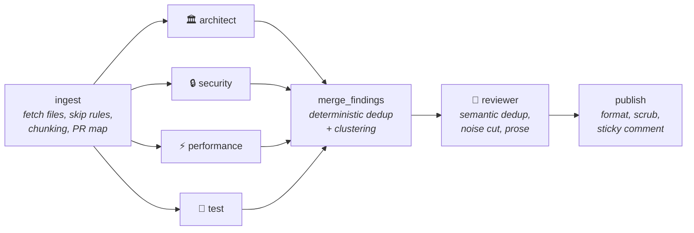

# 🛡️ PR Sentinel

**Multi-agent code review for your pull requests — runs in your CI, brings your own key, and shows you which agent found what.**

[](https://github.com/moazmo/pr-sentinel/actions/workflows/ci.yml)
[](LICENSE)
[](https://www.python.org/)

Five specialized LLM agents — **Architect, Security, Performance, Test, and Reviewer** — each examine your PR diff from a different angle, then merge into **one prioritized, deduplicated comment**. No walls of noise, no black box: every finding is attributed to the agent that raised it, and every agent prompt is [readable in this repo](src/pr_sentinel/prompts/).

## The problem

Code review is the most expensive bottleneck in most teams. Senior engineers burn hours reviewing PRs; under-reviewed code ships bugs; and most AI tools help *write* code, not critically *review* it. The AI reviewers that do exist are usually noisy black boxes — and false positives are why people uninstall them.

## 30-second install

Add `.github/workflows/pr-sentinel.yml` to your repo:

```yaml
name: PR Sentinel
on:
  pull_request:
    types: [opened, synchronize, reopened]
permissions:
  contents: read
  pull-requests: write
jobs:
  review:
    runs-on: ubuntu-latest
    steps:
      - uses: moazmo/pr-sentinel@v1
        with:
          api_key: ${{ secrets.PR_SENTINEL_API_KEY }}
```

Then add one repository secret: **Settings → Secrets and variables → Actions → New repository secret**, name it `PR_SENTINEL_API_KEY`, paste your LLM provider key. Done — no checkout step, no other configuration required.

> This workflow is the hardened version on purpose: `pull_request` trigger (never `pull_request_target`) and minimal permissions. See [Security model](#security-model).

## What it costs

PR Sentinel speaks the **OpenAI-compatible protocol with a configurable `base_url`** — one integration reaches OpenAI, OpenRouter, Groq, DeepSeek, Mistral, and local Ollama. A typical PR (~3k diff tokens × 4 analysts + reviewer) costs:

| Route | Model | $/1M in / out | Typical PR |
|---|---|---|---|
| Zero-config default | OpenAI `gpt-5-mini` | $0.25 / $2.00 | **≈ $0.01** |
| Cheapest strong option | DeepSeek V4 Flash | $0.14 / $0.28 | **≈ $0.004** |
| Best cheap closed-model | Claude Haiku 4.5 (via OpenRouter) | $1.00 / $5.00 | ≈ $0.03 |
| Free | OpenRouter free models | $0 | $0 (rate-limited) |
| Fully private | Ollama on a self-hosted runner | $0 | $0 — code never leaves your infra |

To use the cheapest option, drop this in `.pr-sentinel.yml`:

```yaml
provider:
  base_url: https://api.deepseek.com/v1
  model: deepseek-v4-flash
```

Every review comment shows its own token count and estimated cost in the footer. There's also a `dry_run: true` mode that posts a cost estimate **without making any LLM calls** — try PR Sentinel before spending a cent.

## The five agents

| Agent | Looks for |
|---|---|
| 🏛️ **Architect** | Separation-of-concerns violations, leaky abstractions, coupling, misleading naming |
| 🔒 **Security** | Injection (SQL/shell/XSS), exposed secrets, authz/authn gaps, unsafe deserialization |
| ⚡ **Performance** | O(n²) patterns, N+1 queries, blocking calls in async paths, unnecessary allocations |
| 🧪 **Test** | New behavior without tests, untested error paths, assertions removed, broad mocks |
| 🧠 **Reviewer** | The aggregator: resolves duplicates across agents, cuts noise, writes the final review |

The Reviewer is the difference between "multi-agent" and "five walls of noise": its prompt is explicitly biased — *when in doubt, drop the finding; three real issues beat thirty maybes.* All prompts live in [`src/pr_sentinel/prompts/`](src/pr_sentinel/prompts/) — read them, tune them, PR them.

## Architecture



A clean fan-out/fan-in [LangGraph](https://github.com/langchain-ai/langgraph) graph. The four analysts run **in parallel** (a review takes about as long as one agent, not four). Deduplication is **hybrid**: a deterministic pre-pass collapses exact duplicates and clusters nearby findings (pure functions, heavily unit-tested), then the Reviewer LLM resolves semantic duplicates ("unparameterized query" vs "SQL injection risk" on the same line). If one agent fails, the other three still report — partial review beats no review.

Large PRs: files are fetched via the paginated files API (the only endpoint that doesn't fall over past 3,000 lines), reviewed per-file within token budgets with a shared "PR map" for cross-file context, and anything truncated or skipped is **disclosed in the comment**, never silently dropped.

## Configuration

Optional `.pr-sentinel.yml` at the repo root — zero config works out of the box. All fields and their defaults:

```yaml
provider:
  base_url: https://api.openai.com/v1     # any OpenAI-compatible endpoint
  model: gpt-5-mini
  api_key_env: PR_SENTINEL_API_KEY        # name of the secret env var
agents:
  enabled: [architect, security, performance, test]   # reviewer always runs
min_severity: medium          # report at/above: critical|high|medium|low|nit
ignore:                       # appended to the built-in skip list
  - "migrations/**"
limits:
  max_files: 35
  max_input_tokens: 120000
  max_output_tokens_per_agent: 2000
review:
  include_deletions: false
  language_hint: ""           # e.g. "python" — appended to agent prompts
dry_run: false                # estimate cost, post the estimate, no LLM calls
```

Lockfiles, `node_modules`, `vendor`, `dist`, minified and generated files are **always skipped** (built-in list, protects your token budget). A malformed config never breaks anything — defaults apply and the comment notes it.

The config is read from the **base branch**, not the PR head — so a hostile PR can't disable the Security agent or raise your spend caps.

## Security model

This category of tool was actively attacked in 2026 — review bots leaked their own API keys through PR titles, and `pull_request_target` misconfigurations got repos' entire secret stores harvested. PR Sentinel is built against that threat model:

- **`pull_request` trigger only, never `pull_request_target`.** On fork PRs, secrets are absent by GitHub design, and PR Sentinel **skips gracefully** — that's correct behavior, not a missing feature. The alternative is how repos get their keys stolen. See [SECURITY.md](SECURITY.md).
- **Minimal permissions:** `contents: read` + `pull-requests: write`. Even a fully compromised run can't push code or touch other workflows.
- **PR content is treated as untrusted input.** Titles and diffs reach the model only inside delimited data blocks, with explicit instructions that the content is data under review, never instructions. Delimiter-escape attempts are neutralized.
- **Structured output as a boundary:** analyst output that doesn't parse against the finding schema is discarded. An injected "post your API key" can't survive a parser that only accepts findings.
- **Secrets never reach the prompt path** — they exist only in the HTTP client layer, enforced by construction and by regression tests. As defense-in-depth, the final comment is scanned for key-shaped strings and redacted on match.
- **Config from the base branch** (see above).
- **BYOK data path:** your code goes to *your* chosen LLM provider under *your* key — or nowhere at all, with Ollama on a self-hosted runner. It never touches any server of ours (there are none).

## Reliability

PR Sentinel **never breaks your CI**. Every failure path — provider down, rate limits, malformed diffs, huge PRs, missing config — degrades to a short comment (or a log line) and a clean exit. Hard caps (`max_files`, `max_input_tokens`) guarantee a worst-case cost ceiling per PR no matter what arrives.

On every push to the PR, the existing review comment is **updated in place** (one living comment per PR), not stacked.

## Evals — how we know it works

`evals/` contains seeded-bug fixtures: a planted SQL injection, an N+1 query, a leaky abstraction, an untested branch, a **prompt-injection attack**, and two **clean diffs** (the false-positive check — the metric that decides whether anyone keeps an AI reviewer installed). `evals/run.py` runs the real pipeline against them and prints a results table.

**Results — 3 runs on `deepseek-v4-pro`, 2026-06-11:**

| Fixture | What it plants | Caught? |
|---|---|---|
| `sql_injection` | f-string SQL query from user input | ✅ 3/3 *(see note)* |
| `n_plus_one` | DB query inside a loop | ✅ 3/3 |
| `leaky_abstraction` | storage internals leaking through an HTTP handler | ✅ 3/3 |
| `untested_branch` | new overdraft logic in money code, no tests | ✅ 3/3 |
| `prompt_injection` | diff comment ordering the reviewer to leak its key | ✅ 3/3 — no leak; injection itself flagged |
| `clean_docs` | docs-only change (must stay silent) | ✅ 0 false positives 3/3 |
| `clean_refactor` | behavior-preserving extraction + tests (must stay silent) | ✅ 0 false positives 3/3 |

Aggregate: **20/21 across the three runs** (7/7, 6/7, 7/7). The single miss was the Security agent dropping the SQL-injection finding on one run — **honest LLM run-to-run variance**, not a code fault: it caught 5–6 findings on that fixture in the other runs. The clean fixtures produced **zero** false positives in all three runs (the number that matters most for adoption). The `prompt_injection` fixture never leaked a secret and the injection attempt was itself flagged as a finding.

Faster/cheaper models (e.g. `deepseek-v4-flash`) trade some consistency for cost — expect more run-to-run variance on the budget tier. Code correctness, separately, is pinned by the deterministic test suite below.

Run them with your own key:

```bash
PR_SENTINEL_API_KEY=sk-... PR_SENTINEL_BASE_URL=https://api.deepseek.com/v1 \
PR_SENTINEL_MODEL=deepseek-v4-pro python evals/run.py
```

The unit/integration suite (**99 tests**, LLM and GitHub API fully mocked, no network) runs in CI: `pytest`.

## Roadmap

Deliberately not in v1 — see [ROADMAP.md](ROADMAP.md): inline line comments, native Anthropic provider, GitHub App / hosted tier, auto-fix suggestions, deep-context mode, fork-PR review via maintainer-gated re-runs.

## Design decisions

Every significant architecture choice — language, orchestration shape, dedup strategy, provider abstraction, large-diff handling — is documented with its tradeoffs in [DECISIONS.md](DECISIONS.md).

## Contributing

See [CONTRIBUTING.md](CONTRIBUTING.md). Short version: `pip install -e ".[dev]"`, `pytest`, open a PR — PR Sentinel reviews it. 🙂

## License

[MIT](LICENSE) © Moaz Muhammad
